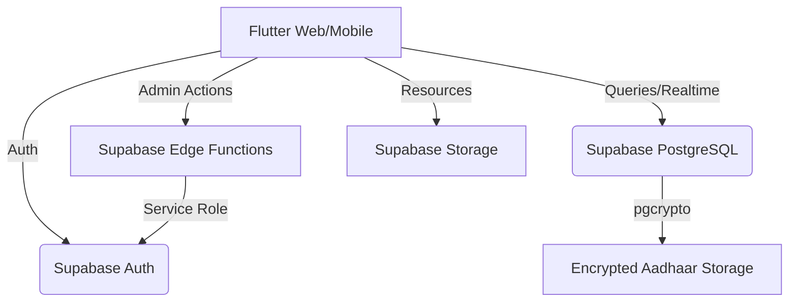

# 📚 Seva Sahayog — Education Platform

<p align="center">
  
</p>

<p align="center">
  A <strong>100% Supabase-native education management system</strong> built for NGOs to manage student enrollment, daily attendance, exam results, and teacher workflows — across 11 zones and 130+ learning centres.
</p>

<p align="center">
  
  
  
  
</p>

---

## 🧭 Table of Contents

- [About the Project](#-about-the-project)
- [Modern Architecture](#-modern-architecture)
- [Core Features](#-core-features)
- [Tech Stack](#-tech-stack)
- [Setup Guide](#-setup-guide)
  - [1. Database Schema](#1-database-schema)
  - [2. Edge Functions](#2-edge-functions)
  - [3. Flutter Application](#3-flutter-application)
- [User Roles & Flows](#-user-roles--flows)
- [Security & Encryption](#-security--encryption)

---

## 📖 About the Project

Seva Sahayog is a high-performance management platform designed to streamline NGO operations. By migrating to a **fully serverless, cloud-native architecture on Supabase**, the platform provides instant synchronization, robust security, and a simplified deployment pipeline.

### Core Features

| Feature | Description |
|---------|-------------|
| **Role-Based Access** | Secure dashboards for Admin, Coordinator, and Teacher roles. |
| **Realtime Attendance** | Mark attendance with instant global updates via Supabase Realtime. |
| **Secure Aadhaar Storage** | Student Aadhaar numbers are **encrypted at rest** using `pgcrypto` in PostgreSQL. |
| **Administrative Control** | Edge Functions for secure user creation and role assignment. |
| **Teacher Diary & Resources** | Digital logs for daily activities and cloud storage for teaching materials. |
| **Automated Analytics** | Zone-wise and centre-wise performance metrics for coordinators. |

---

## 🏗 Modern Architecture

The platform follows a **Clean Cloud-Native** architecture, removing all legacy dependencies on external spreadsheets or middle-tier providers.



### Data Flow — Secure User Creation
1. Admin enters user details in the Flutter UI.
2. Flutter invokes the `create-user` **Edge Function** via a secure HTTPS call.
3. Edge Function uses the `SERVICE_ROLE_KEY` to create an Auth user and initialize the profile.
4. Database triggers automatically handle metadata and logging.

---

## 🛠 Tech Stack

| Layer | Technology |
|-------|-----------|
| **Frontend** | Flutter (Provider + GoRouter) |
| **Backend** | Supabase (PostgreSQL 15+) |
| **Auth** | Supabase Auth (JWT-based) |
| **Logic** | Supabase Edge Functions (TypeScript / Deno) |
| **Storage** | Supabase Storage (Buckets for resources) |
| **Security** | PostgreSQL RLS + pgcrypto Encryption |

---

## 🚀 Setup Guide

### 1. Database Schema
Go to your **Supabase SQL Editor** and apply the migration scripts found in `supabase/migrations/`:

1.  **`001_initial_schema.sql`**: Core tables (`profiles`, `students`, `attendance`, etc.).
2.  **`002_row_level_security.sql`**: RLS policies ensuring users only see their own zone's data.
3.  **`003_rpc_helpers.sql`**: SQL functions for attendance counters.
4.  **`004_schema_patch.sql`**: Enables `pgcrypto` and Aadhaar encryption functions.

### 2. Edge Functions
Administrative user creation requires the `create-user` function.

```powershell
# 1. Login to Supabase CLI
npx supabase login

# 2. Link your project 
npx supabase link --project-ref <your-project-id>

# 3. Deploy the creation logic
npx supabase functions deploy create-user
```
*Note: Ensure you have your `SUPABASE_SERVICE_ROLE_KEY` added to your Function Secrets in the Supabase Dashboard.*

### 3. Flutter Application
Configure your environment in `flutter_app/lib/supabase_config.dart`:

```dart
const String supabaseUrl = 'https://<your-project>.supabase.co';
const String supabaseAnonKey = 'your-anon-public-key';
```

Then run:
```powershell
cd flutter_app
flutter pub get
flutter run -d chrome
```

---

## 👥 User Roles & Flows

### 🔴 Admin (Super User)
*   Full visibility across all **11 Zones** and **130+ Centres**.
*   Creates and manages Coordinators and Teachers.
*   System-wide analytics and center auditing.

### 🟡 Coordinator (Zone Lead)
*   Access scoped specifically to their assigned **Zone**.
*   Approves teacher leave requests.
*   Broadcasts zone-wide announcements.
*   Monitors attendance trends for all centers in their zone.

### 🟢 Teacher (Center Lead)
*   Manages enrollment for their specific **Center**.
*   Daily attendance marking for assigned students.
*   Uploads exam results and maintains a daily teacher diary.
*   Accesses teaching resources from the cloud library.

---

## 🔒 Security & Encryption

The platform prioritizes student data privacy:
*   **Authentication**: All requests are authenticated via JWT.
*   **Granular Access**: Row Level Security (RLS) ensures that a teacher from Zone A cannot see data from Zone B.
*   **Encryption at Rest**: Sensitive Aadhaar data is encrypted at the database level. Even with direct access to the database rows, the data is unreadable without the project's master key.

---

<p align="center">
  <strong>Seva Sahyog Foundation</strong><br>
  Modern. Secure. Cloud Native.<br>
  Made with ❤️ using Flutter & Supabase
</p>